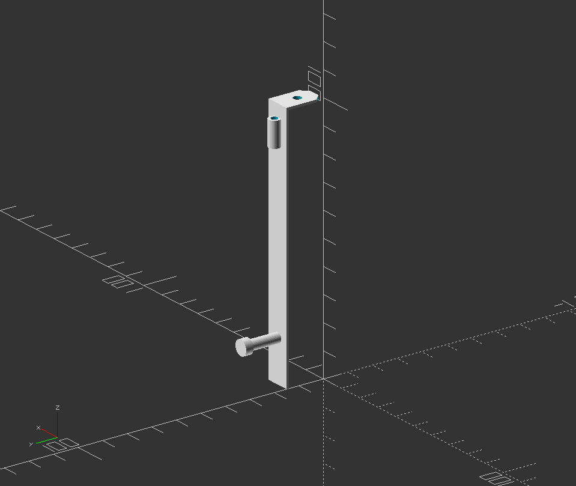

# These are upgrade parts for the Monoprice Select Mini (V2) 3D Printer

This Repository has some upgrade parts I made for my Monoprice Select Mini (V2) Printer.

__40mm Dual Fan Shroud with and without Nozzle Cam__

__Carrier Plate for RPi Displays, etc.__

__Small Tool Holder for an Hex Key and (Pliers)__

# LICENSE

<dl>
 Dieses Werk ist lizenziert unter einer <a rel="license" href="http://creativecommons.org/licenses/by/4.0/">Creative Commons Namensnennung 4.0 International Lizenz</a>.
</dl>

<dl>
 This work is licensed under a <a rel="license" href="http://creativecommons.org/licenses/by/4.0/">Creative Commons Attribution 4.0 International License</a>.
</dl>
