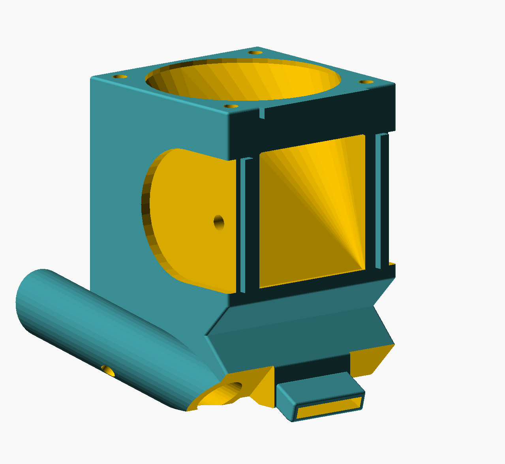
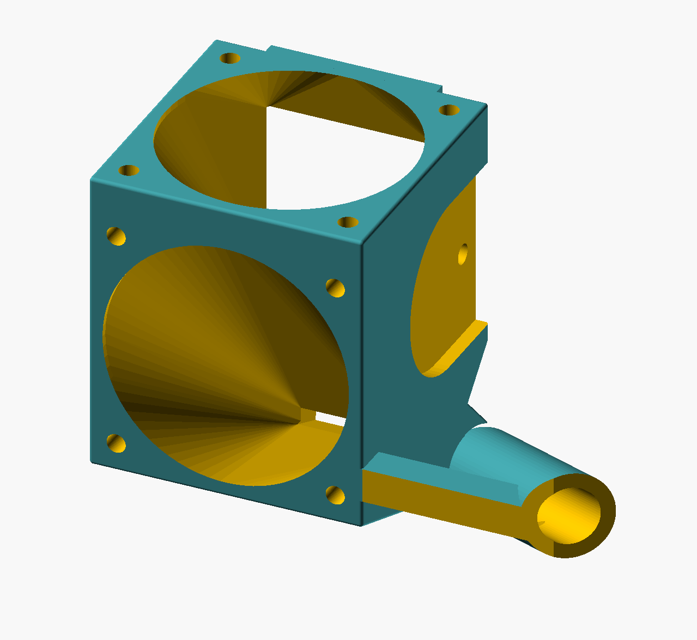
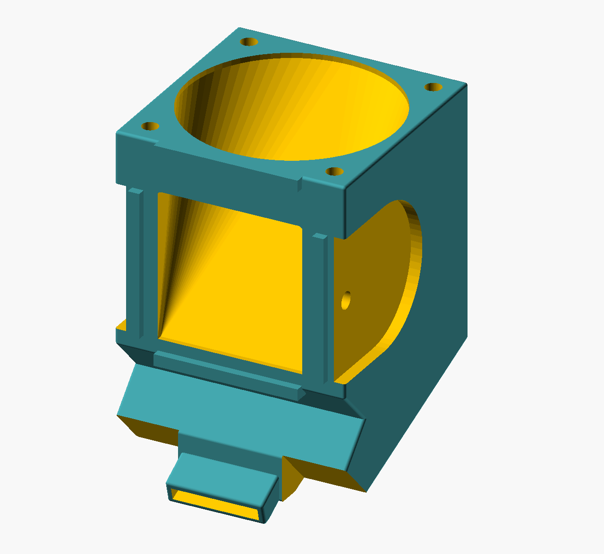
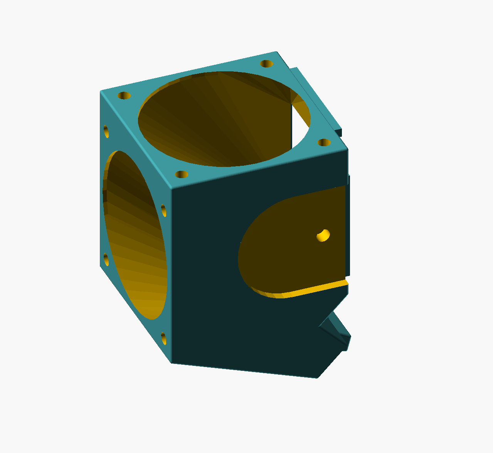

# Dual 40mm fan shroud for Monoprice Selet Mini (v2)

__More fans go brrrrr^2!!!__

Replacement part for Monoprice Select Mini (V2) to hold two 40mm fans. This gives an extra fan for part cooling & hotend cooling.

__With Nozzle Cam__

__Without NozzleCam__

# LICENSE

 Dieses Werk ist lizenziert unter einer <a rel="license" href="http://creativecommons.org/licenses/by-sa/4.0/">Creative Commons Namensnennung - Weitergabe unter gleichen Bedingungen 4.0 International Lizenz</a>.

 This work is licensed under a <a rel="license" href="http://creativecommons.org/licenses/by-sa/4.0/">Creative Commons Attribution-ShareAlike 4.0 International License</a>.
