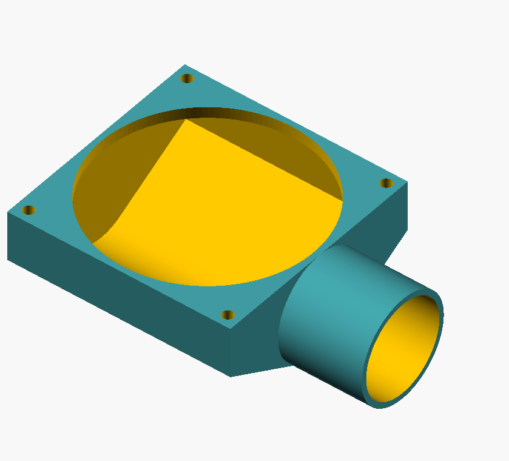
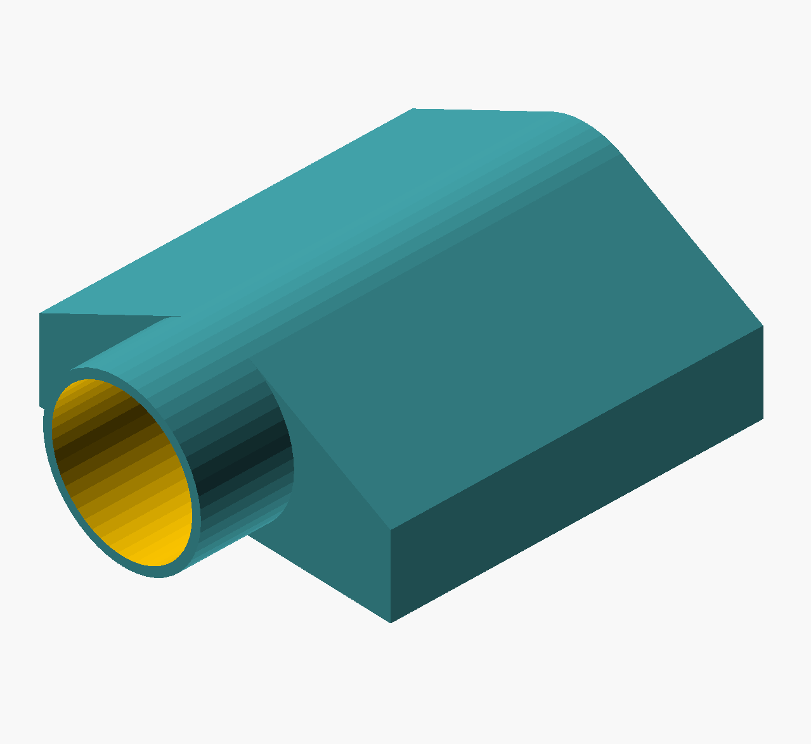

# Air funnel for 80mm Noctua Fan

This is for cooling my 3d printer chambers down. During print the environment temperature rises between 30C to 35C (for my MPSM and Prusa Mini). With this, some prints get less quality due to the temperature

__NOTE__ Still in development!

 

# LICENSE

<dl>
 Dieses Werk ist lizenziert unter einer <a rel="license" href="http://creativecommons.org/licenses/by/4.0/">Creative Commons Namensnennung 4.0 International Lizenz</a>.
</dl>

<dl>
 This work is licensed under a <a rel="license" href="http://creativecommons.org/licenses/by/4.0/">Creative Commons Attribution 4.0 International License</a>.
</dl>
