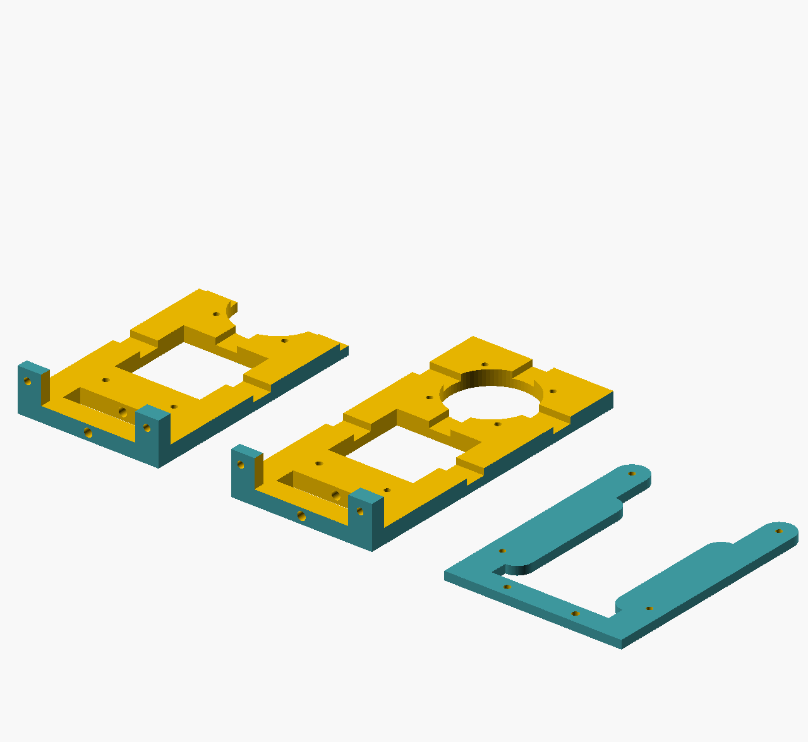
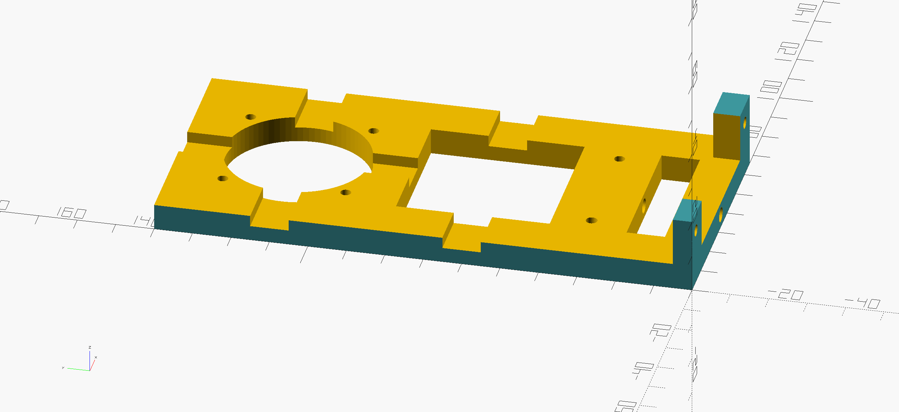
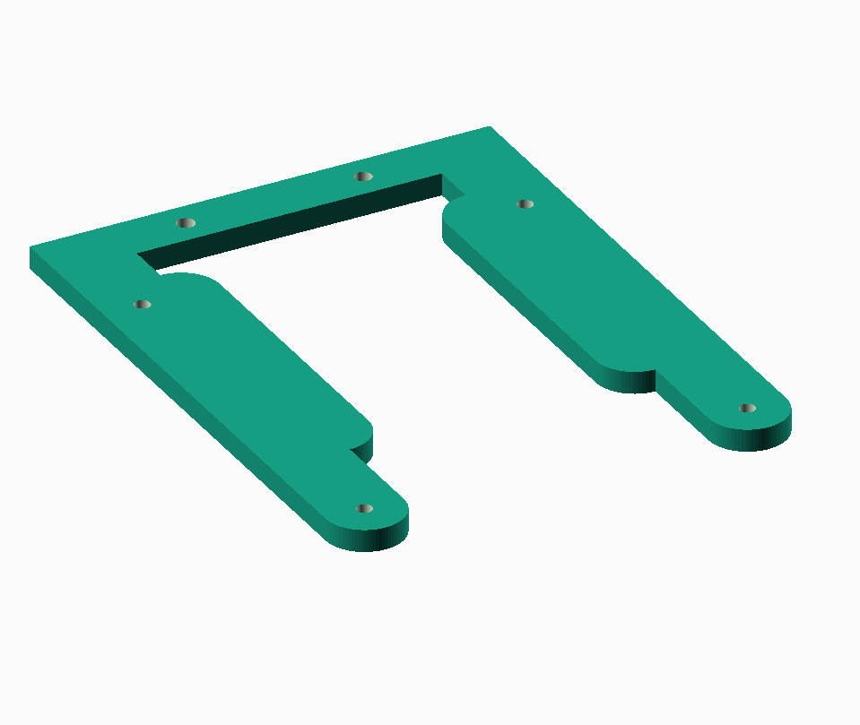
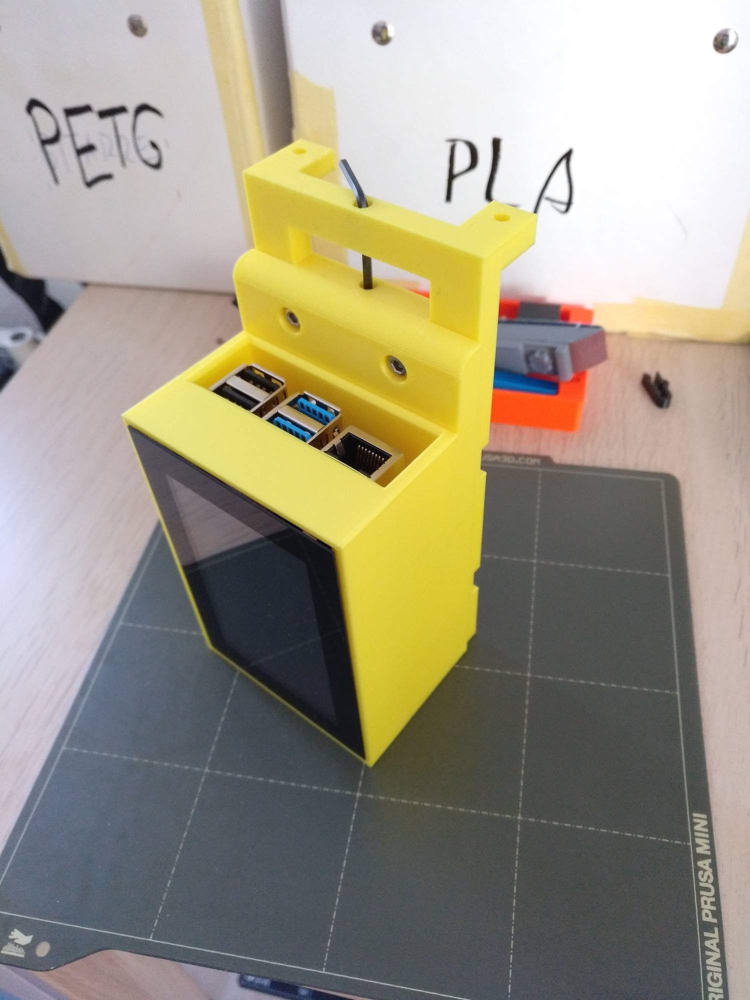
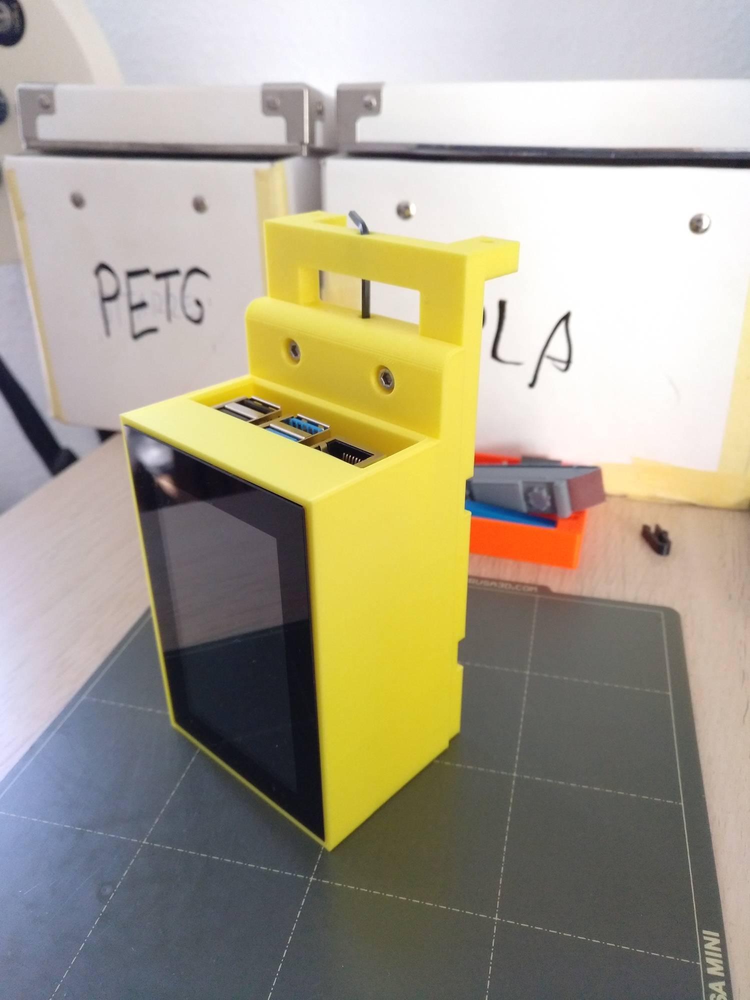
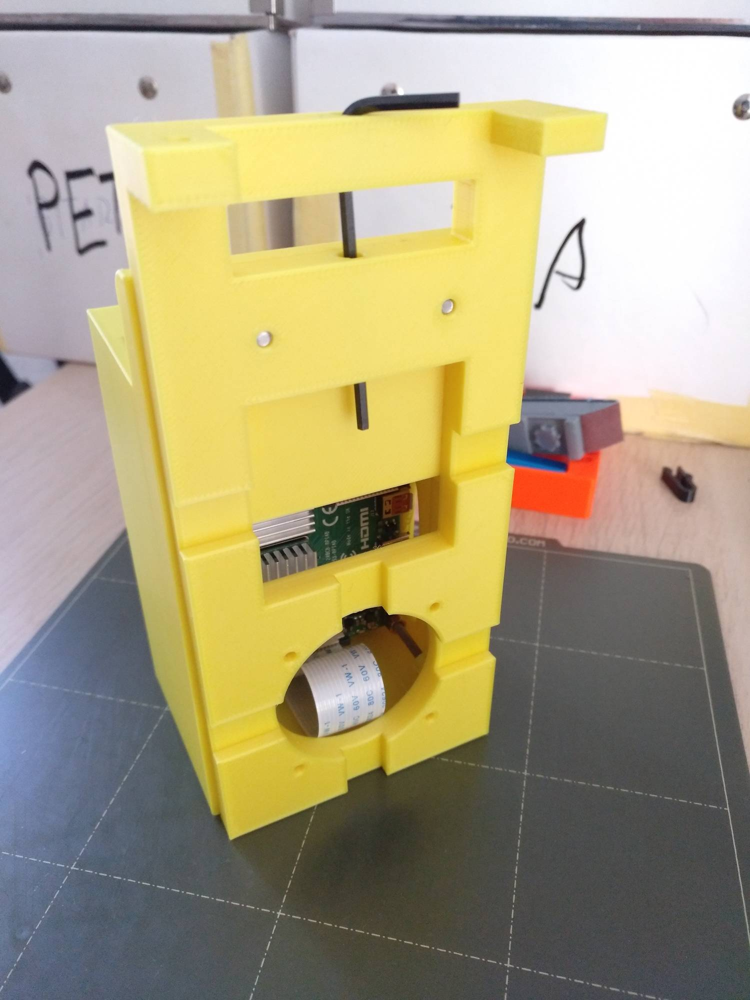
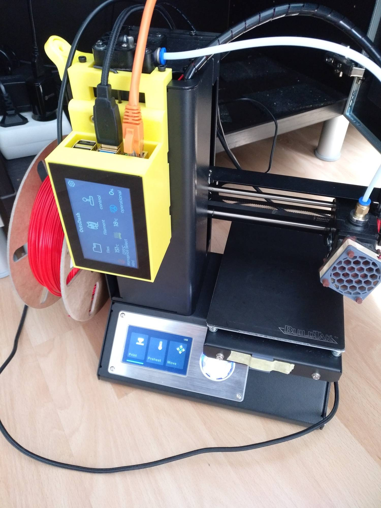
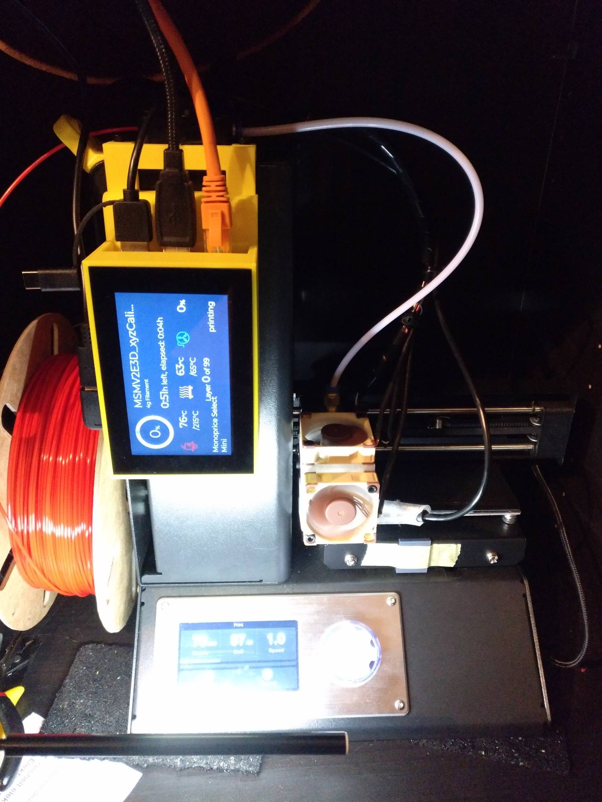
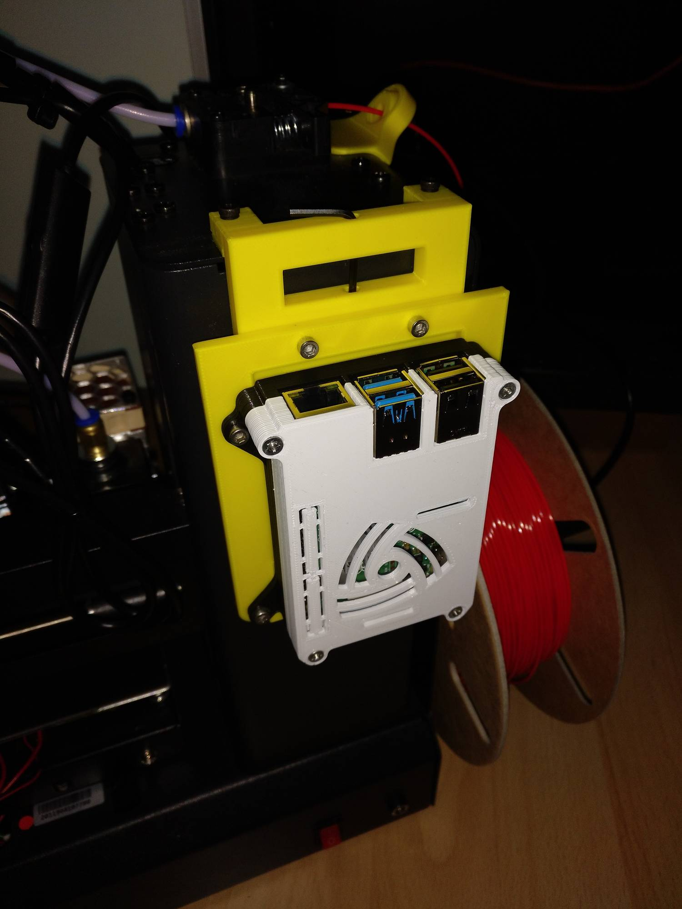
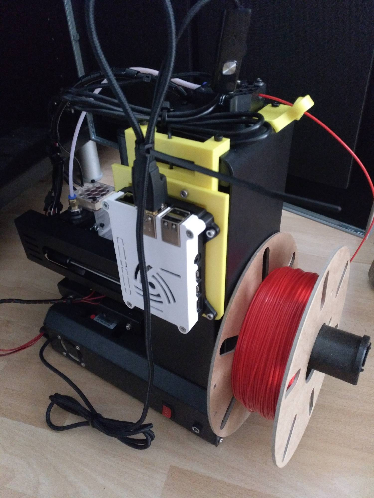

# Carrier Plate for a Raspberry Pi + Display Case

This carrier gets mounted on the front of the monoprice select mini to carry a RPi with Display (running Octodash, Octoscreen, etc).

I used this RPi 4 with a OSOYOO 3.5 inch touch screen display in this case https://www.prusaprinters.org/de/prints/61558-ifactory-one-pi-4b-case . This RPi4 case fits on this carrier.

I also made an adapter to mount this (https://www.thingiverse.com/thing:3714695) case on the carrier. If no display is used it is possible to mount the raspberry pi to the back.
RPi 4 Case: https://www.thingiverse.com/thing:3714695
RPi 3 Case: https://www.thingiverse.com/thing:922740

__Note:__
Carrier Version __A__ is used on my MPSM where I have filament guide mounted on. The mounting plates on top have different thickness.
If all screws on top of your MPSM are free, use Version __B__.
If you want to print this carrier on your MPSM you can print the Versions with 110mm. The 40mm fan can sill be mounted.

Use 3mm screws. For mounting the carrier on the MPSM I used M3x20 and for the rest M3x10.

 

 

# LICENSE

<dl>
 Dieses Werk ist lizenziert unter einer <a rel="license" href="http://creativecommons.org/licenses/by/4.0/">Creative Commons Namensnennung 4.0 International Lizenz</a>.
</dl>

<dl>
 This work is licensed under a <a rel="license" href="http://creativecommons.org/licenses/by/4.0/">Creative Commons Attribution 4.0 International License</a>.
</dl>
